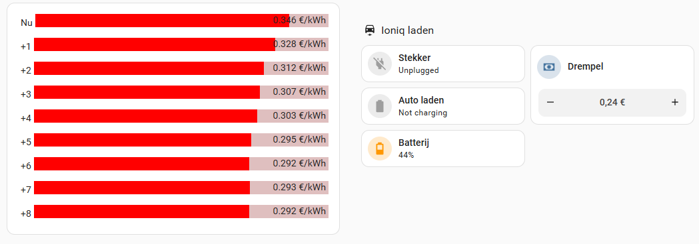

# Charge Hyundai / Kia based on energy price threshold

This repository describes how I use the [KIA / Hyundai integration](https://github.com/Hyundai-Kia-Connect/kia_uvo) (install with [HACS](https://www.home-assistant.io/blog/2024/08/21/hacs-the-best-way-to-share-community-made-projects/)) in [Home Assistant](https://www.home-assistant.io/) to dynamically charge my Hyundai Ioniq 6 based on the dynamic engergy prices of my energy contract (Zonneplan).
The energy prices are collected with the [Unofficial Zonneplan integration for Home Assistant](https://github.com/fsaris/home-assistant-zonneplan-one). You can also use this when you are not a customer of Zonneplan. The prices are currently the day-ahead prices from The Netherlands + € 0,02.

## Main panel

The main panel for my setup looks like this:



(Yes, it was a cold day in January 2024 when I took this screenshot, with hight energy prices :-( )

The process is controlled by threshold to start / stop charging, which is an "input number helper" type in HA:


Charging starts when the price drops below the threshold and stops when the price rises above the threshold (and does not change whatever it's doing when it's exactly the threshold, but that's how HA works / floats work).

The three items on the left are just tile cards which show the status of the car. The "Plug" tile also has actions bound to it:
- Update the status from Hyundai when tapped on the icon
- Force update from the car when long-pressed on the tile

The configurations for the three tiles are:

``` yaml
type: tile
entity: binary_sensor.ioniq6_ev_battery_plug
name: Stekker
icon_tap_action:
action: perform-action
perform_action: kia_uvo.update
target: {}
hold_action:
action: perform-action
perform_action: kia_uvo.force_update
target: {}
```

``` yaml
type: tile
entity: binary_sensor.ioniq6_ev_battery_charge
name: Auto laden
```

``` yaml
type: tile
entity: sensor.ioniq6_ev_battery_level
name: Batterij
```

The threshold control is defined with:

``` yaml
type: tile
entity: input_number.ioniq_laad_drempel
show_entity_picture: false
hide_state: true
name: Drempel
icon: mdi:cash
features:
- type: numeric-input
    style: buttons
```

Of course, the name of your car in the kai_uvo might be different. Mine is called "IONIQ6".

## Automations

I have the following automations to start / stop charging:

``` yaml
alias: Ioniq start laden
description: ""
triggers:
  - trigger: numeric_state
    entity_id:
      - sensor.zonneplan_current_electricity_tariff
    below: input_number.ioniq_laad_drempel
conditions:
  - condition: state
    entity_id: binary_sensor.ioniq6_ev_battery_plug
    state: "on"
actions:
  - action: kia_uvo.start_charge
    data: {}
    enabled: true
  - delay:
      hours: 0
      minutes: 0
      seconds: 10
      milliseconds: 0
  - action: kia_uvo.update
    metadata: {}
    data: {}
mode: single
```

``` yaml
alias: Ioniq stop laden
description: ""
triggers:
  - trigger: numeric_state
    entity_id:
      - sensor.zonneplan_current_electricity_tariff
    above: input_number.ioniq_laad_drempel
conditions:
  - condition: state
    entity_id: binary_sensor.ioniq6_ev_battery_charge
    state: "on"
actions:
  - action: kia_uvo.stop_charge
    data: {}
    enabled: true
  - delay:
      hours: 0
      minutes: 0
      seconds: 10
      milliseconds: 0
  - action: kia_uvo.update
    metadata: {}
    data: {}
mode: single
```

You may notice I have a condition for the "start" script which requires the car to be plugged in and for the "stop" script for the car to be charging. You could leave those out, but it prevents useless communication to the car. The risk is, though, the car will not start charging if the "plugged in" status is not correctly updated. Both automation wait 10 seconds after the action and then request an update of the car status.

## Final result

With this setup I can easily check the upcoming prices and select at which price level I want the charging to start / stop and the scripts will take care of this. The actions are the same remote start / stop actions as used in the Hyundai Blue Link app, so they will respect you maximum charging level.
